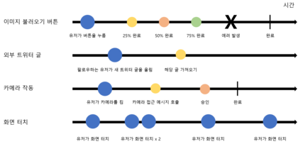
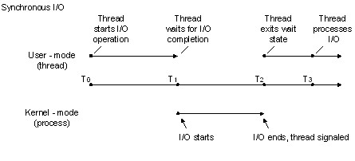
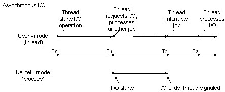
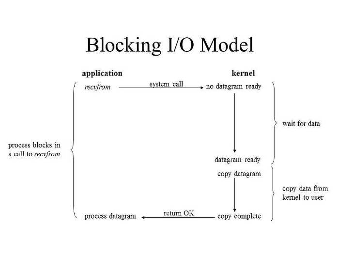
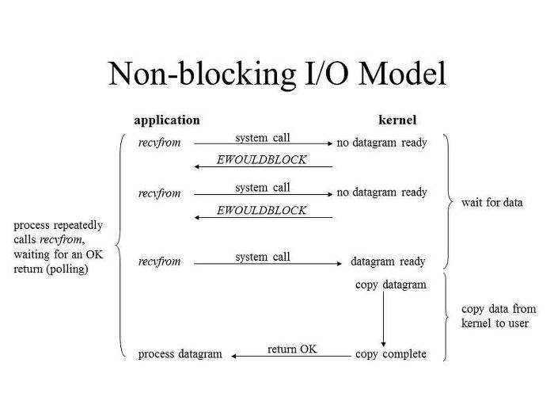

Reactive Streams의 핵심 인터페이스가 Java9의 `java.util.concurrent.Flow` 클래스에 새롭게 추가되었습니다.

## Reactive Programming 이란?

>[Reactive programming](https://en.wikipedia.org/wiki/Reactive_programming) 이란 비동기 데이터 흐름(data flow)에 기반을 둔 프로그래밍 패러다임이다.    
>데이터 흐름이 강과 같아서 이를 관찰하거나 필터링하는 등 다양하게 다룰 수 있으며 새로운 사용자를 위한 새로운 flow를 만들기 위해 다른 flow와 병합할 수 도 있다.     
>(in RxJava Essentials)

`"Reactive Programming is programming with asynchronous data streams."`

반응형 프로그래밍은 비동기적 데이터 흐름을 처리하는 프로그래밍 방식입니다.   
이러한 관점에서 Reactive Programming은 Asynchronous Dataflow Programming 이라고도 불립니다.

Reactive Programming의 핵심은 모든것을 비동기적인 데이터 stream으로 간주하고 Observer 디자인 패턴을 사용해서, 이러한 비동기 이벤트를 처리하는 것에 있습니다.     

Data Stream은 이름 그대로 데이터의 큰 흐름, 데이터 물줄기의 흐름입니다.     
Async한 Data Stream은 아래 그림처럼 표현할 수 있습니다.     

참고로 여기에서 Data stream이 값을 생성한 뒤 토해내는 것을 `Emit(분출)`이라고도 합니다.



Reactive Programing은 기본적으로 모든 것을 스트림`(stream)`으로 바라보며, 발생하는 이벤트, ajax call등 모든 데이터의 흐름을 시간순서에 의해 전달되어지는 스트림으로 처리합니다.   

여기서 스트림`(stream)`이란 시간순서에 의해 전달되어진 값들의 collection 정도로 이해하시면 쉽습니다.   
각각의 스트림은 새로 만들어져서`(branch)` 새로운 스트림이 될 수도 있고 여러개의 스트림이 합쳐질수 도 있습니다`rea(merge)`.   

스트림은 map, filter과 같은 함수형 메소드를 이용하여, immutable하게 처리할 수 있으며, 스트림을 listening 함으로써 데이터의 결과값을 얻을 수 도 있습니다. 이를 `subscribe`라고 표현합니다.


## Reactive Streams
최근 Reactive Programming은 Java 커뮤니티에서 큰 인기를 얻었습니다.    
Java world에서는 [RxJava](https://github.com/ReactiveX/RxJava)나 [Reactor](http://projectreactor.io/) 와 같은 인기있는 reactive 라이브러리가 존재하고 있습니다. 

[Reactive Streams](http://www.reactive-streams.org/)은 non-blocking back pressure 를 사용하여 비동기 스트림 처리 표준을 제공하기 위한 새로운 프로세스입니다.

### Back pressure ?
* publisher가 subscriber가 소비하는 속도보다 훨씬 더 빠른 속도로 메시지를 생성할 때 back pressure가 발생합니다.  
* 처리되지 않은 항목을 버퍼링해두는 buffer의 크기는 제한될 수 있습니다.   
* Flow API는 back pressure를 처리하거나 back pressure 신호를 보내는 기능을 제공하고 있지는 않지만, back pressure를 처리하기 위해 개발자가 스스로 구현할 수 있는 다양한 전략이 존재할 수는 있습니다.

### 추가 공부
### Sync vs Async ? 
결과 값을 return 받는 시점에 초점을 두면 쉽게 이해할 수 있습니다.

#### Synchronous

* system call이 끝날 때 까지 기다렸다가 return된 결과값을 가져옴.

#### Asynchronous

* system call이 완료되지 않아도 process flow가 끝남
* 추후 system call 작업이 완료되고 결과가 나왔을때 결과값을 가져옴
* 주로 callback function을 많이 사용

### Blocking vs Non-Blocking ?
application의 실행 flow에 초점을 두면 쉽게 이해할 수 있습니다.

#### Blocking

* application은 system call이 끝날 때 까지 대기
* system call이 완료되었을 경우 return작업을 진행
* wait queue에 들어감
* 예: C의 scanf()

#### Non-Blocking

* application은 system call이 완료되지 않아도 대기 없이 return
* wait queue에 들어가지 않음

### Non-Blocking vs Asynchronous ?
* Asynchronous는 처리결과와 관련없이 요청이 들어왔을 경우 바로 응답한다. 이후 결과값을 가지고 데이터를 전달할 준비가 되었을때 결과 값을 돌려준다.
* Non-Blocking은 요청에 처리할 수 있다면 바로 응답하고, 아니라면 exception이나 error를 반환한다.

## Flow API
Java9의 Flow API는 실질적인 표준인 Reactive Stream Specification에 해당합니다.   
Flow API (및 Reactive Streams API)는 어떤면에서는 Iterator 및 Observer 패턴의 아이디어를 결합한 것이라고 할 수 있습니다.   

Iterator는 application이 소스에서 데이터를 가져오는 `pull` 모델입니다.   
반대로 Observer는 소스의 데이터를 application으로 push하는 `push` 모델입니다.   

Flow API를 사용한 application은 처음에 n개 데이터를 요청한 뒤, publisher가 n개 데이터를 subscriber에게 push합니다.    
따라서 pull과 push 모델이 혼합되어 있다고 볼 수 있습니다.

### Interfaces
```java
@FunctionalInterface   
public static interface Flow.Publisher<T> {  
    public void    subscribe(Flow.Subscriber<? super T> subscriber);  
}   
  
public static interface Flow.Subscriber<T> {  
    public void    onSubscribe(Flow.Subscription subscription);  
    public void    onNext(T item) ;  
    public void    onError(Throwable throwable) ;  
    public void    onComplete() ;  
}   
  
public static interface Flow.Subscription {  
    public void    request(long n);  
    public void    cancel() ;  
}   
  
public static interface Flow.Processor<T,R>  extends Flow.Subscriber<T>, Flow.Publisher<R> {  
}  
```

## Flow.Publisher<T>
* 등록된 subscriber에게 데이터 항목의 stream을 넘겨줍니다.
* 일반적으로 executor를 사용하여 async하게 생성합니다.
* 각 subscription에 대해 subscriber의 메서드를 매우 엄격한 순서로 호출합니다. 

Flow.Subscriber 타입의 subscriber를 추가하는 `void subscribe (Flow.Subscriber <? super T> subscriber)` 메소드 하나만을 가지고 있는 단순한 인터페이스 입니다.
Flow.Publisher<T>는 subscriber에게 데이터를 발행하는 역할을 맡고 있습니다.      

publisher가 발행할 수 있는 알림/메시지 유형은 3가지 입니다. 아래 <표>를 참고하세요.

| method       | description                                |
|:-------------|--------------------------------------------|
| onNext()     | 새로운 아이템이 발행(published)되었습니다.         |
| onComplete() | 더 이상 메시지나 알림이 발행되지 않습니다.           |
| onError()    | 데이터 항목을 발행하던 중에 오류가 발생했습니다.       |

onComplete 와 onError 모두 종료되는 시점에 호출되므로(terminal notifications) 이후 더이상 메시지 혹은 알림이 발행되지 않습니다.

### sample
```java
import java.util.concurrent.SubmissionPublisher;  
...  
    //Create Publisher  
    SubmissionPublisher<String> publisher = new SubmissionPublisher<>();  
  
    //Register Subscriber  
    MySubscriber<String> subscriber = new MySubscriber<>();  
    publisher.subscribe(subscriber);  
  
    //Publish items  
    System.out.println("Publishing Items...");  
    String[] items = {"1", "x", "2", "x", "3", "x"};  
    Arrays.asList(items).stream().forEach(i -> publisher.submit(i));  
    publisher.close();  
```

## Flow.Subscriber<T>
* Flow.Publisher가 게시한 메시지 혹은 알림을 수신하는 수신기입니다.
* 구독자(Subscriber)는 callback을 위해 게시자(Publisher)를 바라봅니다(구독).
* 데이터는 별도로 요청하지 않는 한 subscriber에게 push되지 않습니다.
    * 일반적으로 여러 항목들을 한꺼번에 요청합니다.
* application은 subscriber가 사용할 수 있는 다음과 같은 callback들에게 반응합니다.

| method                                           | description   |
|:-------------------------------------------------|--------------|
| void onSubscribe(Flow.Subscription subscription) | 지정된 subscription(구독)에 대해 다른 subscriber의 메서드를 호출하기 전에 실행되는 메서드 |
| void onNext(T item)                              | subscription 다음 실행되는 메서드 |
| void onError(Throwable throwable)                | publisher혹은 subscription에서 복구할 수 없는 오류가 발생하는 경우 호출되는 메서드 <br> onError가 호출되고 나면 더 이상 메시지를 받지 않습니다.
| void onComplete()                                | subscription에서 더 이상 subscriber의 메서드를 호출하지 않는 경우 최종적으로 호출되는 메서드입니다. <br> subscription에서 이제 더 이상 메시지가 생성되지 않는 경우 subscriber는 onComplete를 실행합니다. |
    
### sample
```java
import java.util.concurrent.Flow.*;  
...  
  
public class MySubscriber<T> implements Subscriber<T> {  
  private Subscription subscription;  
  
  @Override  
  public void onSubscribe(Subscription subscription) {  
    this.subscription = subscription;  
    subscription.request(1); //a value of  Long.MAX_VALUE may be considered as effectively unbounded  
  }  
  
  @Override  
  public void onNext(T item) {  
    System.out.println("Got : " + item);  
    subscription.request(1); //a value of  Long.MAX_VALUE may be considered as effectively unbounded  
  }  
  
  @Override  
  public void onError(Throwable t) {  
    t.printStackTrace();  
  }  
  
  @Override  
  public void onComplete() {  
    System.out.println("Done");  
  }  
}  
```

## Flow.Subscription
* Flow.Publisher와 Flow.Subscriber을 연결합니다. 
* subscriber가 publisher를 성공적으로 바라볼 때 (성공적으로 가입했을 때) 구독을 나타냅니다.
* 가입한 subscriber의 onSubscribe() 메서드의 parameter로 전달됩니다.
```
void request(long n)
    발행된 n개 데이터 항목을 publisher에게 요청합니다.
void cancel()
    구독을 취소합니다.
```

## Flow.Processor<T, R>
* publisher와 subscriber 역할 둘 다 수행할 수 있는 component.
* publisher와 subscriber 사이에 위치하여 stream을 또 다른 stream으로 변환합니다.
* 함께 연결된 하나 이상의 프로세서가 존재할 수 있습니다.
* 최종 process 결과가 subscriber에 의해 처리됩니다.
* JDK는 processor interface만 제공할 뿐이므로, processor가 필요한 경우 interface를 직접 구현하여 사용하면 됩니다.

### Sample Processor 1 (to transform String to Integer)
```java
import java.util.concurrent.Flow.*;  
import java.util.concurrent.SubmissionPublisher;  
...  
public class MyTransformProcessor<T,R> extends SubmissionPublisher<R> implements Processor<T, R> {  
  
  private Function function;  
  private Subscription subscription;  
  
  public MyTransformProcessor(Function<? super T, ? extends R> function) {  
    super();  
    this.function = function;  
  }  
  
  @Override  
  public void onSubscribe(Subscription subscription) {  
    this.subscription = subscription;  
    subscription.request(1);  
  }  
  
  @Override  
  public void onNext(T item) {  
    submit((R) function.apply(item));  
    subscription.request(1);  
  }  
  
  @Override  
  public void onError(Throwable t) {  
    t.printStackTrace();  
  }  
  
  @Override  
  public void onComplete() {  
    close();  
  }  
}  
```
### Sample Processor 2 (to transform data stream using processor)
```java
import java.util.concurrent.SubmissionPublisher;  
...  

    //Create Publisher  
    SubmissionPublisher<String> publisher = new SubmissionPublisher<>();  
  
    //Create Processor and Subscriber  
    MyFilterProcessor<String, String> filterProcessor = new MyFilterProcessor<>(s -> s.equals("x"));  
  
    MyTransformProcessor<String, Integer> transformProcessor = new MyTransformProcessor<>(s -> Integer.parseInt(s));  
  
    MySubscriber<Integer> subscriber = new MySubscriber<>();  
  
    //Chain Processor and Subscriber  
    publisher.subscribe(filterProcessor);  
    filterProcessor.subscribe(transformProcessor);  
    transformProcessor.subscribe(subscriber);  
  
    System.out.println("Publishing Items...");  
    String[] items = {"1", "x", "2", "x", "3", "x"};  
    Arrays.asList(items).stream().forEach(i -> publisher.submit(i));  
    publisher.close();  
```


## SubmissionPublisher
위에 언급된 핵심 인터페이스를 이해하기는 쉽지만, 제대로 구현하기는 쉽지 않습니다.   

하지만 구현에 일일히 신경쓰실 필요는 없습니다.   
이미 기존에 구현된 다른 라이브러리에 의존하는 방법도 있으니까요.

`java.util.concurrent.SubmissionPublisher<T>`는 Flow의 구현 중 하나로써, 스트림을 닫을 때 까지 데이터 항목을 subscriber에게 비동기적으로 발행하는 publisher입니다.   

어떻게 사용하느냐에 따라, SubmissionPublisher의 executor를 constructor에 지정할 수 있습니다.   

>NOTE: 개별 스레드에 데이터를 발행하고, subscriber 개수를 예측할 수 있는 경우 `Executors.newFixedThreadPool(int)` 및 constructor 메서드를 사용하는게 좋습니다.

```java
SubmissionPublisher(Executor executor, int maxBufferCapacity);
// maxBufferCapacity: the maximum capacity for each subscriber's buffer.
```

또 다른 방법으로는 `ForkJoinPool.commonPool()`을 사용하는 기본 생성자(constructor)를 호출하는 방법이 있습니다.

```java
publisher.consume((data) -> process(data));
```

데이터를 발행하는데는 크게 두가지 방식이 있습니다.

| method   | description | 
|:---------|-------------|
| submit() | 데이터를 비동기적으로 각각의 subscriber에게 발행하지만 실제로 resource를 사용할 수 있을 때 까지 차단(block)합니다. |
| offer()  | 데이터를 비동기적으로 현재 사용가능한 subscriber들에게 발행합니다. 다만, 리소스 제한을 초과하는 경우 하나 이상의 subscriber가 데이터를 삭제할 수 있습니다 .|

*그 외 몇가지 유용한 방법:*    

| method | description |
|:-------|-------------|
| CompletableFuture<Void> consume(Consumer<? super T> consumer) | 지정된 consumer를 사용하여 발행된 모든 데이터 항목을 처리합니다. <br>    반환되는 CompletableFuture(Void)는 publisher에서 onComplete()를 호출했을때 혹은 발생한 에러를 예외처리하여 완료되는 경우 일반적으로 사용되는 완료 결과 값입니다. |
| close​() | publisher를 닫고 구독중인 모든 subscriber에게 신호를 전달합니다. |
| closeExceptionally​(Throwable error) | publisher를 닫고 구독중인 모든 subscriber에게 close 신호 및 발생한 오류를 전달합니다. |
| estimateMaximumLag​() | 현재 publisher를 구독중인 모든 subscriber 에서 발행되었지만 아직 consume하지 않은 데이터 추정치 중 최대값을 구합니다. |
| estimateMinimumDemand​() | 현재 publisher를 구독중인 모든 subscriber 중에서 request 요청하였지만 아직 발행되지 않은 데이터 항목의 추정치 중 최소값 추정치를 구합니다. |
| hasSubscribers​() | 해당 publisher가 subscriber를 가지고 있는지 확인합니다. |
| isSubscribed​(Subscriber) | 입력된 subscriber가 해당 publisher를 구독하고 있는지 판단합니다. |
| getNumberOfSubscribers​() | subscriber 개수를 반환합니다. |
| getSubscribers​() | 현재 구독중인 subscriber 리스트를 반환합니다. |


## 참고

### 참고한 사이트
[Reactive Programming with JDK 9 Flow API - 번역](http://jhleed.tistory.com/99)     
[Reactive Programming with JDK 9 Flow API](https://community.oracle.com/docs/DOC-1006738)     
[Java 9 FLow SubmissionPublisher – A Concrete Publisher](http://javasampleapproach.com/java/java-9-flow-submissionpublisher-concrete-publisher)

### RxJava에 대한 정말 잘 쓴 글들     
[Grokking RxJava Part1: The Basics](http://blog.danlew.net/2014/09/15/grokking-rxjava-part-1/)
[Grokking RxJava Part2: Operator, Operator](http://blog.danlew.net/2014/09/22/grokking-rxjava-part-2/)

[Grokking RxJava Part3: Reactive with Benefits](http://blog.danlew.net/2014/09/30/grokking-rxjava-part-3/)

### 더 보면 좋을 글
[멈추지 않고 기다리기(Non-Blocking)와 비동기(Asynchronous) 그리고 동시성(Concurrency)](https://tech.peoplefund.co.kr/2017/08/02/non-blocking-asynchronous-concurrency.html)